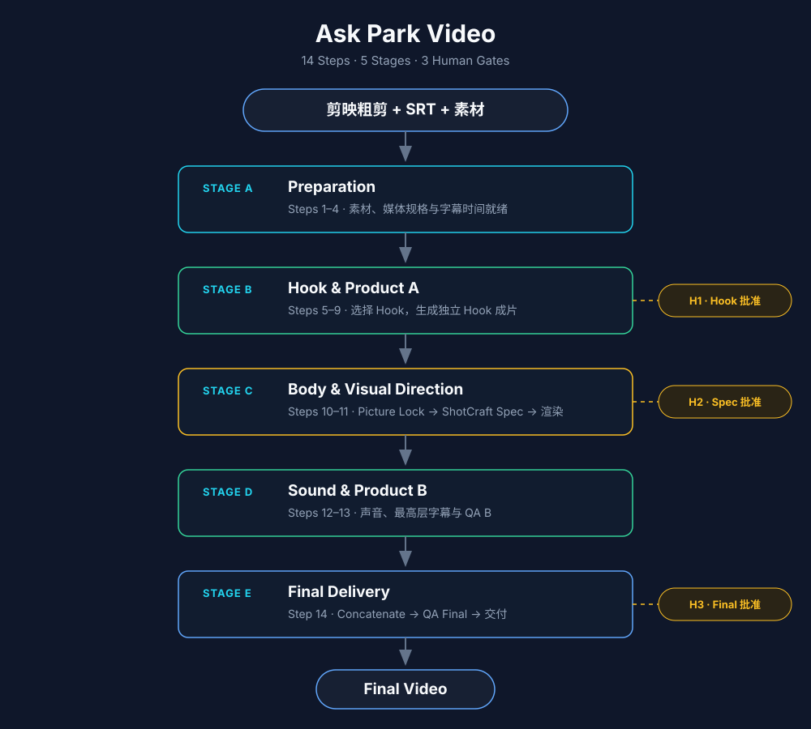

<div align="center">

# Ask Park Video

> *「你只管把口播录下来，Agent 必须知道下一步。」*

[](SKILL.md)
[](https://skills.sh/zinan92/park-koubo-workflow)
[](VIDEO_WORKFLOW.md)
[](#三个人工审批门)
[](https://github.com/Vincentwei1021/video-shotcraft)
[](LICENSE)

**把剪映粗剪视频与 SRT，持续路由成 Hook、正文视觉、声音、字幕和经过 QA 的最终成片。**

[看流程](#它怎么工作) · [生产预设](#生产预设) · [安装](#快速开始) · [视觉导演](#video-shotcraft-视觉导演) · [审批门](#三个人工审批门) · [完整规范](VIDEO_WORKFLOW.md)

</div>

---

```text
in   剪映粗剪视频 + SRT + 可选原始素材 + 已有项目状态
out  Product A Hook + Product B 正文 + Final Video + QA 证据

fail 等待 Hook / Visual Spec / Final 批准 → 展示准确产物并停在当前 Gate
fail 缺少必需素材或依赖                     → 标记 blocked，并说明唯一下一动作
```



<sub>一条主线：输入 → 五个 Stage → Final Video；[查看 PNG](assets/ask-park-video-simple-flow.png)</sub>

---

## 它解决什么问题

口播视频最容易卡住的地方，不是某个特效不会做，而是每次换一个 Agent，都要重新解释“我们做到哪一步了”“接下来应该干什么”“什么时候必须找我”。

Ask Park Video 把这些决定写成一个可恢复的路由器。它根据已有文件和验收证据找到最早未完成的步骤，自动向后执行；正常路径只在 Hook、Visual Spec 和 Final 三个真正需要人判断的地方暂停。

它不替代剪映、FFmpeg、Remotion 或 Video ShotCraft。它负责让这些工具在正确的时间出现，并确保批准发生在返工成本最低的位置。

---

## 它怎么工作

现有 [14 步 Workflow](VIDEO_WORKFLOW.md) 保持不变，Skill 只在上面增加五个大阶段：

| Stage | Steps | 做完的标志 |
| --- | ---: | --- |
| A. Preparation | 1–4 | 素材保全，粗剪与可靠字幕时间就绪 |
| B. Hook & Product A | 5–9 | Hook 经批准并独立成片，QA A 通过 |
| C. Body & Visual Direction | 10–11 | 正文 Picture Lock，视觉规格批准并渲染 |
| D. Sound & Product B | 12–13 | 声音、最高层字幕与 QA B 完成 |
| E. Final Delivery | 14 | A/B 合并，QA Final 与最终验收完成 |

每次调用时，Router 会：

1. 读取 `project.json`、`process-log.md`、媒体、字幕和已有产物；
2. 用真实文件验证状态，而不是只相信“已完成”标签；
3. 找到最早没有通过完成条件的 Step；
4. 自动持续执行，直到审批门、真实阻塞或最终完成；
5. 保存当前 Step、证据和审批记录，下次从这里继续。

---

## 生产预设

Skill 不再要求 Agent “冻结一个没有定义的样式”。4:3 口播默认直接读取四个版本化 preset：

| Preset | 固定内容 | 默认值摘要 |
| --- | --- | --- |
| [caption style](presets/captions/park-caption-4x3-v1.json) | 字体、颜色、黑底、圆角、位置、缩放 | PingFang SC 40；`#FFFDF6`；窄黑底；底部居中 40px |
| [caption layout](presets/captions/park-caption-layout-v1.json) | 断句、换行、时间与 QA | 优先一行、最多两行；按语义断句；背景跟随文字宽度 |
| [media](presets/media/park-talking-head-4x3-v1.json) | 画幅、FPS、编码、色彩与采样率 | 1440×1080、30fps、H.264、BT.709、AAC 48kHz |
| [audio](presets/audio/park-voice-v1.json) | 人声响度与可选声音轨规则 | -16 LUFS、LRA 7、True Peak -1.5 dBTP；BGM/SFX 默认关闭 |

这些值按 reference canvas 等比缩放。当前默认只支持 4:3；其他画幅必须选择新的版本化 preset，不能临场换成白字描边、全宽 Banner 或其他字幕设计。

---

## 三个人工审批门

| Gate | 发生位置 | Park 审批什么 | 批准后发生什么 |
| --- | --- | --- | --- |
| H1 · Hook | Step 5 | 原话、来源时间与播放顺序 | 精确切片并完成 Product A |
| H2 · Visual Spec | Step 11 | 每一镜的内容、素材、时点与总覆盖率 | 才允许正式渲染视觉层 |
| H3 · Final | Step 14 后 | 最终视频、QA 结果与已知限制 | 项目完成 |

普通步骤不会反复询问。只有缺凭据、素材不可访问、破坏性范围变化，或准备删除拍摄指令时，才会作为异常阻塞停下来。

---

## Video ShotCraft 视觉导演

[Video ShotCraft](https://github.com/Vincentwei1021/video-shotcraft) 在 Step 11 接管 Product B 的完整视觉轨道，而不只是“做动画”。它统一判断什么时候应该保留人脸，以及什么时候使用：

- 本人的真实 B-roll 或有来源记录的外部 B-roll；
- 截图与屏幕录制；
- 图表与 Illustration；
- 透明动效层；
- 全屏 Remotion / HyperFrames 动画。

它先生成 `visual-plan.json`，再自动导出给人阅读的 spec table。每个镜头必须包含时间范围、表达目的、视觉类型、素材来源，以及 `enter → reveal → hold → exit` 四个时点。

```text
visual coverage = 所有已批准视觉增强区间的时间并集 / Product B 时长
default target  = 30%–40%
```

重叠区间只计算一次；Hook、人脸原画面、字幕、BGM 和 SFX 不计入。30%–40% 是默认规划目标，不是凑动效的理由；偏离时必须把原因写进 spec table，并在 H2 一起批准。

---

## 快速开始

安装 Router 与视觉导演：

```bash
npx skills add zinan92/park-koubo-workflow -g
npx skills add Vincentwei1021/video-shotcraft -g
```

然后对 Agent 说：

```text
Use $ask-park-video to start this talking-head video project:
/absolute/path/to/my-video-project
```

继续已有项目：

```text
Use $ask-park-video to inspect this project and continue from the next unverified step.
```

---

## 触发方式

- `$ask-park-video`
- “用 ask park video 开始剪这支口播。”
- “继续这个口播项目，告诉我下一步。”
- “检查现有产物，从第一个没验收的步骤继续。”
- “生成 Visual Spec，等我批准后再渲染。”
- “完成 Product A / Product B / Final QA。”

这个 Skill 默认只接受显式调用，不会在普通视频对话里自动启动。

---

## 它会交付什么

```text
project.json                 当前 Step、证据与三次审批状态
part-a-hook/video.mp4        Hook 独立成片
part-b-body/visual-plan.json 可执行视觉真值
part-b-body/video.mp4        正文成片
final/video.mp4              最终成片
part-*/qa.json               QA A / QA B / QA Final 证据
```

完整目录、字幕双源对齐、B-roll 来源规则、声音轨与归档要求见 [VIDEO_WORKFLOW.md](VIDEO_WORKFLOW.md)。

---

## 安全边界

- 不因为 Hook 在前面播放过，就从正文删除原句。
- 不在 H2 批准前渲染正式 B-roll 或动效。
- 不用外部素材证明它无法证明的事实，且外部视频默认静音。
- 不把字幕覆盖视觉层视为错误；只检查实际可读性和裁切。
- 不用“文件生成了”代替完整播放与 QA。
- 不在三个正常 Gate 之外制造常规 handholding；真实阻塞必须明确标记。

---

## 文件结构

```text
park-koubo-workflow/
├── SKILL.md                         # Agent 入口、Router 与审批合同
├── agents/openai.yaml               # Codex 显式调用配置
├── VIDEO_WORKFLOW.md                # 14 步详细流程的 canonical truth
├── tests/router-cases.json          # Resume 与 Gate 路由用例
├── examples/router-dry-run.md       # 可检查的最小路由示例
├── presets/                         # 媒体、声音、字幕样式与排版真值
├── scripts/validate_presets.py      # 检查四个 preset 的交叉一致性
├── assets/ask-park-video-simple-flow.* # README 静态流程图
└── diagram/park-koubo-workflow.*    # 完整静态流程图
```

---

## 验证与测试

基础结构检查：

```bash
python3 /path/to/skill-creator/scripts/quick_validate.py .
python3 scripts/validate_presets.py
jq empty tests/router-cases.json
```

最关键的验收场景：当 Steps 1–10 已有通过证据、但没有 `visual-plan.json` 时，Agent 必须进入 Step 11，调用 Video ShotCraft 生成规格，并停在 H2；不得重做前序步骤，也不得提前渲染。

完整 dry run 见 [examples/router-dry-run.md](examples/router-dry-run.md)。

---

## 致谢

- [Vincentwei1021/video-shotcraft](https://github.com/Vincentwei1021/video-shotcraft) — Step 11 的视觉导演、镜头配方与视觉 QA 工具库。
- [LearnPrompt/luban-skill](https://github.com/LearnPrompt/luban-skill) — 公共 Skill 的验料、亮活、验证门与 README 方法。

## License

[MIT](LICENSE)

---

<div align="center">

*准备 → Hook → Visual Spec → Product B → Final*

**自动前进，只在真正需要 Park 判断的地方停。**

</div>
